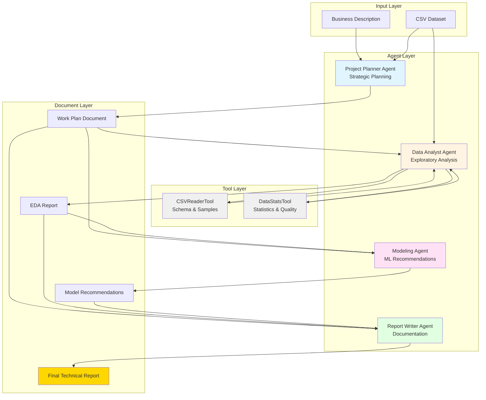

# Multi-Agent Agentic AI System Architecture

## System Overview

This document describes the architecture of a multi-agent system designed to assist data science teams in analyzing datasets and generating comprehensive technical reports. The system uses **CrewAI** to orchestrate collaboration between four specialized AI agents, each with distinct roles, goals, and capabilities.

## Architecture Diagram



## Agent Descriptions

### 1. Project Planner Agent

**Role:** Senior Data Science Project Planner

**Goal:** Translate business objectives and problems into comprehensive, actionable data science work plans that guide the team through analysis, modeling, and reporting phases.

**Backstory:** An experienced data science project manager with over 15 years of expertise leading analytics teams across various industries. This agent possesses a unique talent for breaking down complex business problems into clear, structured action plans. With deep knowledge of the data science lifecycle, the planner understands business requirements, defines project scope, identifies necessary analyses, and creates roadmaps that ensure projects stay on track. Having successfully planned hundreds of data science projects ranging from customer analytics to predictive modeling, this agent knows exactly what steps are needed to deliver valuable insights. The planner's work is characterized by thoroughness combined with practicality, always keeping the end goal in mind while accounting for data quality issues and technical constraints. Expert at anticipating challenges and building contingency plans.

**Tools:** None (strategic thinking only)

**Input Documents:**
- Business description
- CSV dataset path

**Output Documents:**
- Detailed work plan
- Project objectives and scope
- Analysis roadmap

---

### 2. Data Analyst Agent

**Role:** Senior Data Analyst and Statistician

**Goal:** Conduct thorough exploratory data analysis to uncover patterns, distributions, correlations, and data quality issues. Provide actionable insights that inform modeling decisions and highlight important features and relationships in the data.

**Backstory:** A highly skilled data analyst with a PhD in Statistics and 12 years of hands-on experience in data exploration and analysis. This agent has an exceptional eye for detail and can spot patterns and anomalies that others miss. Expertise spans descriptive statistics, data visualization, and data quality assessment, with experience across finance, healthcare, e-commerce, and technology sectors. Known for the ability to transform raw data into meaningful insights through systematic exploratory analysis, this agent understands that data quality is paramount and always checks for missing values, outliers, and distribution characteristics before any modeling work begins. The agent's EDA reports are comprehensive yet focused, highlighting the most important findings without overwhelming stakeholders with unnecessary details. Possesses a talent for explaining statistical concepts in accessible language and always ties findings back to business implications.

**Tools:**
- **CSVReaderTool**: Reads CSV structure, displays schema and sample data
- **DataStatsTool**: Computes comprehensive statistical summaries

**Input Documents:**
- Work plan from Planner
- CSV dataset

**Output Documents:**
- Exploratory Data Analysis (EDA) report
- Statistical summaries
- Data quality assessment
- Feature insights

---

### 3. Modeling Agent

**Role:** Machine Learning Engineer and Model Architect

**Goal:** Propose appropriate baseline machine learning models based on the problem type and data characteristics. Define comprehensive evaluation metrics that accurately measure model performance and align with business objectives. Provide clear rationale for model selection.

**Backstory:** An expert machine learning engineer with 10 years of experience building predictive models across diverse domains. Holds a Master's degree in Computer Science with a focus on Machine Learning and has published research on model selection and evaluation. The agent's strength lies in quickly identifying the most suitable algorithms for different problem types—whether classification, regression, clustering, or time series. With deep knowledge of classical machine learning algorithms including logistic regression, decision trees, random forests, gradient boosting, and support vector machines, this agent knows when each is most appropriate. Understands that baseline models should be simple, interpretable, and quick to train, serving as benchmarks for more complex approaches. Expertise extends to evaluation metrics—knowing that accuracy isn't always the right metric and can recommend F1-score, precision, recall, AUC-ROC for classification, or RMSE, MAE, R² for regression, always considering business context and class imbalance. Known for providing clear explanations of why certain models and metrics are appropriate, making complex ML concepts accessible to stakeholders.

**Tools:** None (domain knowledge and reasoning)

**Input Documents:**
- Work plan from Planner
- EDA report from Analyst

**Output Documents:**
- Baseline model recommendations (2-3 models)
- Evaluation metrics definition
- Model selection rationale
- Implementation considerations

---

### 4. Report Writer Agent

**Role:** Technical Writer and Data Science Communicator

**Goal:** Compile all analyses, findings, and recommendations into a coherent, well-structured technical report. Ensure the report is professional, clear, and accessible to both technical and business audiences. Create a narrative that flows logically from problem definition through analysis to conclusions and recommendations.

**Backstory:** A specialized technical writer with 8 years of experience documenting data science projects and research. This agent has a unique background combining a degree in English Literature with professional training in data analytics, making them fluent in both technical and business language. Having written hundreds of analysis reports, research papers, and executive summaries, the agent understands how to tailor content for different audiences. Reports are known for their clarity, logical flow, and ability to make complex technical concepts understandable without oversimplifying. Excels at synthesizing information from multiple sources into a cohesive narrative. Knows the importance of proper structure—starting with clear objectives, presenting methodology and findings systematically, and concluding with actionable insights. Meticulous about formatting, ensuring consistent use of headings, proper markdown syntax, and visual hierarchy. Understands that a good report doesn't just present data—it tells a story that guides readers to understanding and action. Always includes an executive summary, clear section headings, bullet points for key findings, and actionable recommendations. Writing is concise yet comprehensive, striking the perfect balance between detail and readability.

**Tools:** None (synthesis and communication skills)

**Input Documents:**
- Work plan from Planner
- EDA report from Analyst
- Model recommendations from Modeler

**Output Documents:**
- Final technical report (Markdown format)
- Executive summary
- Comprehensive documentation

## Data Flow

The system follows a sequential execution model:

1. **Planning Phase**
   - Input: Business description + CSV path
   - Agent: Project Planner
   - Output: Work plan document

2. **Analysis Phase**
   - Input: Work plan + CSV dataset
   - Agent: Data Analyst (using CSVReaderTool & DataStatsTool)
   - Output: EDA report with statistical insights

3. **Modeling Phase**
   - Input: Work plan + EDA report
   - Agent: Modeling Agent
   - Output: Baseline model recommendations + evaluation metrics

4. **Reporting Phase**
   - Input: Work plan + EDA report + Model recommendations
   - Agent: Report Writer
   - Output: Final technical report

## Tool Specifications

### CSVReaderTool

**Purpose:** Read and preview CSV files to understand dataset structure

**Capabilities:**
- Display column names and data types
- Show dataset shape (rows × columns)
- Preview sample rows
- Identify columns with missing values

**Input:** CSV file path, number of sample rows
**Output:** Formatted text with schema and sample data

**Assigned To:** Data Analyst Agent only

---

### DataStatsTool

**Purpose:** Compute comprehensive statistical summaries

**Capabilities:**
- Descriptive statistics (mean, median, std, min, max, quartiles)
- Missing value analysis with percentages
- Cardinality analysis for categorical features
- Outlier detection using IQR method
- Distribution insights
- Data quality warnings (high cardinality, constant columns, duplicates)

**Input:** CSV file path
**Output:** Detailed statistical analysis report

**Assigned To:** Data Analyst Agent only

## Document Specifications

### Work Plan Document
- **Producer:** Project Planner Agent
- **Consumers:** All downstream agents
- **Content:** Project objectives, analysis steps, modeling strategy, timeline
- **Format:** Structured text (500-800 words)

### EDA Report
- **Producer:** Data Analyst Agent
- **Consumers:** Modeling Agent, Report Writer Agent
- **Content:** Statistical summaries, data quality assessment, feature insights
- **Format:** Detailed analysis (800-1200 words)

### Model Recommendations
- **Producer:** Modeling Agent
- **Consumers:** Report Writer Agent
- **Content:** 2-3 baseline models, evaluation metrics, rationale
- **Format:** Structured recommendations (600-900 words)

### Final Technical Report
- **Producer:** Report Writer Agent
- **Consumers:** End users/stakeholders
- **Content:** Complete analysis from introduction to conclusions
- **Format:** Professional Markdown document (1500-2500 words)
- **Sections:**
  - Executive Summary
  - Introduction
  - Exploratory Data Analysis
  - Baseline Models and Evaluation
  - Discussion and Insights
  - Conclusions and Recommendations

## System Execution

The system is executed via the main script:

```bash
python main.py --topic "Business objective" --csv "path/to/data.csv"
```

**Execution Flow:**
1. Load environment configuration (OpenAI API key)
2. Instantiate all 4 agents
3. Create tasks with dependencies
4. Assemble CrewAI crew with sequential process
5. Execute crew.kickoff() with inputs
6. Save final report as `report_final.md`

## Technology Stack

- **Framework:** CrewAI (multi-agent orchestration)
- **LLM:** OpenAI GPT models (via CrewAI default)
- **Data Processing:** Pandas, NumPy
- **ML Libraries:** scikit-learn (for modeling references)
- **Language:** Python 3.8+

## Key Design Decisions

1. **Sequential Process:** Tasks execute in order to ensure proper information flow and dependencies
2. **Tool Isolation:** Only the Data Analyst has access to data tools, preventing other agents from getting distracted
3. **Context Passing:** Each task receives context from previous tasks to maintain coherence
4. **Single Responsibility:** Each agent has one clear role and doesn't delegate
5. **Baseline Focus:** System emphasizes simple, interpretable models as starting points
6. **Business Alignment:** All agents tie technical work back to business objectives

## Limitations and Considerations

- Requires OpenAI API access and credits
- Analysis quality depends on dataset structure and completeness
- Limited to tabular CSV data format
- No automatic model implementation (recommendations only)
- Sequential execution means one failed task blocks downstream work
- No interactive refinement loop (single-pass execution)
